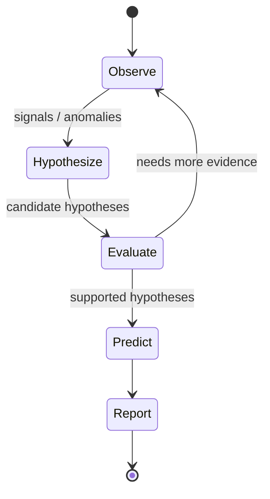

# AI Crawler — Conceptual Lifecycle

The AI Crawler (Trend Analyst) is **not a scraper**. It never contacts external
platforms. It operates entirely on internal state — the concept graph, the
vector store, and its own persistent memory — using a **stateless LLM** as a
reasoning engine.

> Phase 0 implements **no reasoning**. `agent/lifecycle.py` names and orders the
> stages and declares the ports each depends on; `run_cycle` raises
> `NotImplementedError`.

## The loop

1. **Observe** — traverse the graph over a window (`GraphRepository`), retrieve
   relevant evidence/posts (`VectorRepository`), and log what was observed to
   **episodic** memory.
2. **Hypothesize** — turn detected `TrendSignal`s into `Hypothesis` objects
   (`TrendAnalyzer.form_hypotheses`); store in **hypothesis** memory.
3. **Evaluate** — gather supporting/contradicting `Evidence`, update `status`
   and `confidence`. May loop back for more evidence.
4. **Predict** — emit `Prediction`s with a resolution `horizon`; store in
   **predictive** memory. Outcomes are resolved later.
5. **Report** — synthesize a `TrendReport`; store in **report** memory.

## The five memory classes

Persistent memory lives in the **application data layer** (via `AgentMemory`),
**never inside the LLM** or its context window.

| Class | Holds | Example model |
| --- | --- | --- |
| **episodic** | what the agent observed and did | `MemoryRecord` |
| **semantic** | concepts, entities, relationships, embeddings | graph + vectors |
| **hypothesis** | beliefs + supporting/contradicting evidence | `Hypothesis` |
| **predictive** | predictions and later outcomes | `Prediction` |
| **report** | historical trend analyses and conclusions | `TrendReport` |

## Why the LLM is not memory

The LLM is replaceable and stateless (`LLMProvider`) — no vendor lock-in, and no
durable knowledge stored in weights or context. This keeps the system's memory
inspectable, portable, and independent of any single model. Swapping the model
must never lose what TIDE knows.
