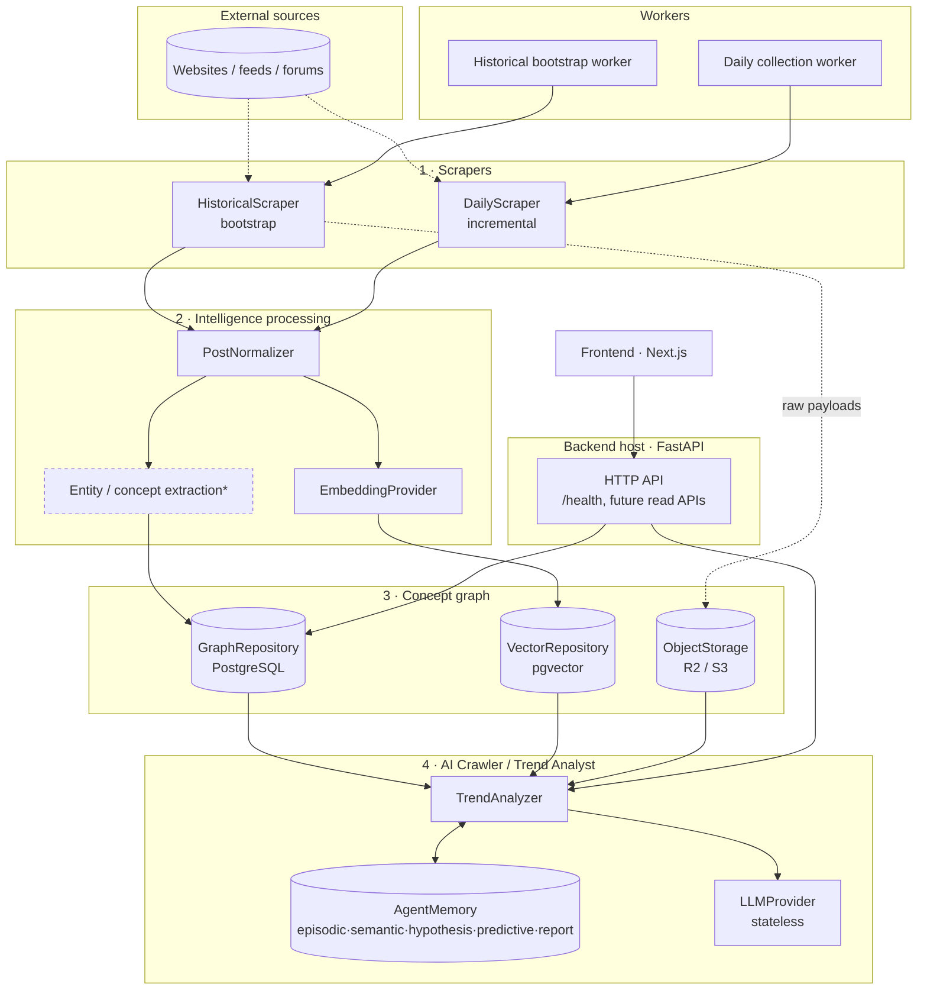

# TIDE Architecture

TIDE (Concept Graph and Trend Intelligence System) is built from **four
fundamentally separate systems** connected through stable, dependency-free
contracts. This document covers the overall architecture, each subsystem's
responsibility, and the data flow between them.

- Topics: overall architecture · subsystem responsibilities · data flow
- Related: [storage](storage.md) · [scraper lifecycle](scraper-lifecycle.md) ·
  [AI Crawler lifecycle](agent-lifecycle.md) · [phases](phases.md)

## 1. Overall architecture

TIDE uses a **ports-and-adapters (hexagonal)** design. A single package,
`contracts/`, holds the domain models and the abstract interfaces ("ports").
Every other package depends on `contracts/`, and nothing depends back on the
subsystems. This is what lets us swap a PostgreSQL graph store, an embedding
provider, or an LLM later without rewriting callers.



`*` Entity/concept extraction and everything the AI Crawler does are **not
implemented in Phase 0** — see [phases](phases.md). The diagram shows the target
shape the scaffold is built to accept.

Dependency direction (the rule that keeps this clean):

```
scrapers ─┐
intelligence ─┤
graph ─┤──▶ contracts  ◀── backend (composition root wires everything)
agent ─┤
workers ─┘
```

## 2. Subsystem responsibilities

| Subsystem | Package | Responsibility | Must NOT |
| --- | --- | --- | --- |
| **Contracts** | `contracts/` | Domain models + abstract ports shared by all. | Import frameworks, drivers, or SDKs. |
| **Scrapers** | `scrapers/` | Turn sources into `RawPost`s. Historical vs. daily kept separate. | Normalize, store, or reason. |
| **Intelligence** | `intelligence/` | Normalize posts; extract entities/concepts; embed; build relationships. | Contact sources; own persistence. |
| **Concept graph** | `graph/` | Persist & traverse concepts, entities, relationships, evidence, metrics, signals. | Scrape; make LLM calls. |
| **AI Crawler** | `agent/` | Traverse the graph, form/evaluate hypotheses, predict, report, persist memory. | Scrape external platforms; treat the LLM as memory. |
| **Workers** | `workers/` | Orchestrate workflows (windows, checkpoints, scheduling). | Contain scraping/reasoning logic. |
| **Backend host** | `backend/` | Composition root: config, logging, DB session, HTTP API. | Own domain logic. |
| **Frontend** | `frontend/` | Present intelligence (dashboard, later). | Talk to the DB directly. |

Cross-cutting concerns live in `backend/core/` (config, logging) — deliberately
small, not a shared "utils" dumping ground. Anything domain-neutral and shared
goes in `contracts/`; anything domain-specific belongs to its subsystem.

## 3. Data flow

**Collection → knowledge → intelligence**

1. A **worker** (bootstrap or daily) resolves a `ScrapeWindow` and asks the
   **scraper registry** for the scraper handling each seed source.
2. The **scraper** yields `RawPost`s. Large payloads go to **ObjectStorage**;
   rows reference them by key. Dedup uses `RawPost.dedup_key` for idempotency.
3. The **intelligence** pipeline normalizes each post into a `NormalizedPost`,
   extracts entities/concepts, and produces embeddings via the
   **EmbeddingProvider**.
4. Extracted knowledge is written to the **concept graph** (`GraphRepository`);
   embeddings go to the **vector store** (`VectorRepository`).
5. The **AI Crawler** reads the graph and vectors, retrieves evidence, forms and
   evaluates hypotheses using a **stateless LLM**, writes durable state through
   **AgentMemory**, and emits `TrendReport`s.
6. The **backend API** exposes reads; the **frontend** renders them.

See [data flow in the scraper lifecycle](scraper-lifecycle.md) and the
[AI Crawler lifecycle](agent-lifecycle.md) for the per-subsystem detail.
