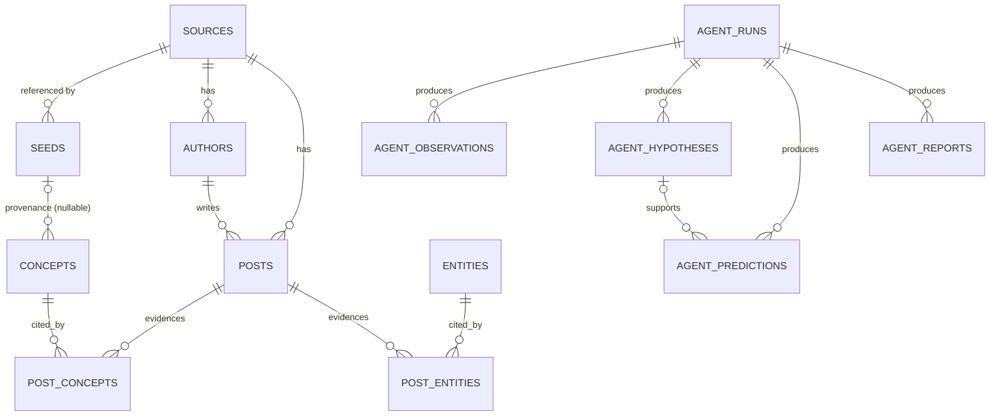

# TIDE Data Model (Phase 1)

The complete persistent schema, reproducible from a clean database with Alembic
migrations only (`make migrate`). All tables use UUID primary keys (client-side
`uuid4`, or deterministic `uuid5` for seed/demo rows), `created_at`/`updated_at`
timestamps, and a JSONB `metadata` column where noted.

## Groups

`graph_edges`, `time_series_observations`, and `embeddings` reference graph nodes
polymorphically by `(type, id)` (concept/entity/edge), so they have no single FK
and are omitted from the ER diagram above.

## Curated configuration

**`sources`** — collection platform registry.
`source_key` (unique), `display_name`, `source_type`, `enabled`, `metadata`.

**`seeds`** — curated seeds (topics + source-specific targets).
`key` (unique, stable/deterministic), `name`, `seed_type`, `source_id` (FK, NULL
for global topics), `canonical_value`, `aliases`, `priority`, `enabled`, `config`,
`origin` (`seed_list.yaml`|`manual`|`promoted`), `source_config_version`,
`imported_at`. Indexed on `seed_type`, `source_id`, `enabled`.

## Collected content

**`authors`** — `source_id` (FK), `external_author_id`, `username`,
`display_name`, `profile_url`. **Unique** `(source_id, external_author_id)`.

**`posts`** — the high-volume table.
`source_id` (FK), `external_id`, `author_id` (FK, SET NULL), `title`, `content`,
`url`, `published_at`, `collected_at`, `language`, `content_hash`, `engagement`
(JSONB), `raw_payload_uri` (→ object storage). **Unique** `(source_id,
external_id)` for idempotent ingestion. Indexes: `published_at`, `collected_at`,
`author_id`, `content_hash` (source/external served by the leftmost of the unique
constraint — no redundant index).

## Discovered knowledge

**`entities`** — `canonical_name`, `entity_type` (open), `aliases`, `status`,
`first_seen_at`, `last_seen_at`. Independent of the seed list.

**`concepts`** — `canonical_name`, `concept_type`, `aliases`, `status`,
`origin` (`discovered`|`seed_list.yaml`|`manual`), `seed_id` (FK, **nullable**,
SET NULL), `first_seen_at`, `last_seen_at`. Discovered concepts: `origin='discovered'`,
`seed_id=NULL`.

**`post_concepts`** / **`post_entities`** — evidence associations.
`post_id` (FK CASCADE), `concept_id`/`entity_id` (FK CASCADE), `confidence`,
`extraction_method`, `extraction_model`. **Unique** `(post, node, extraction_method)`.

## Temporal graph & metrics

**`graph_edges`** — directed, temporal edges.
`source_node_type`/`source_node_id`, `target_node_type`/`target_node_id`
(node type **CHECK** in `concept|entity`), `relationship_type`, `weight`,
`confidence`, `evidence_count`, `first_observed_at`, `last_observed_at`.
**Unique** on the full edge tuple.

**`time_series_observations`** — raw historical metrics (no derived trend math).
`subject_type` (CHECK `concept|entity|edge`), `subject_id`, `granularity` (CHECK
`hour|day|week|month`), `bucket_start`, `mention_count`, `unique_authors`,
`engagement_sum`, `source_diversity`, `metrics` (JSONB). **Unique** `(subject_type,
subject_id, granularity, bucket_start)` prevents duplicate buckets. Edge subjects
let "A became increasingly associated with B over time" be represented.

## Semantic vectors

**`embeddings`** — pgvector-ready. `owner_type`/`owner_id`, `provider`, `model`,
`dim`, `embedding` (**dimensionless** `vector`), `content_hash`. **Unique**
`(owner_type, owner_id, model)`. No model, dimension, or ANN index chosen yet.

## Agent memory

**`agent_runs`**, **`agent_observations`**, **`agent_hypotheses`**,
**`agent_predictions`**, **`agent_reports`** — see [agent-memory.md](agent-memory.md).
Run status and prediction status are CHECK-constrained.

## Reproducibility

`make db-up && make migrate` takes an empty database to this full schema. The
migration also runs `CREATE EXTENSION IF NOT EXISTS vector`. No manual table
creation in Supabase is required — see [supabase-r2-setup.md](supabase-r2-setup.md).
