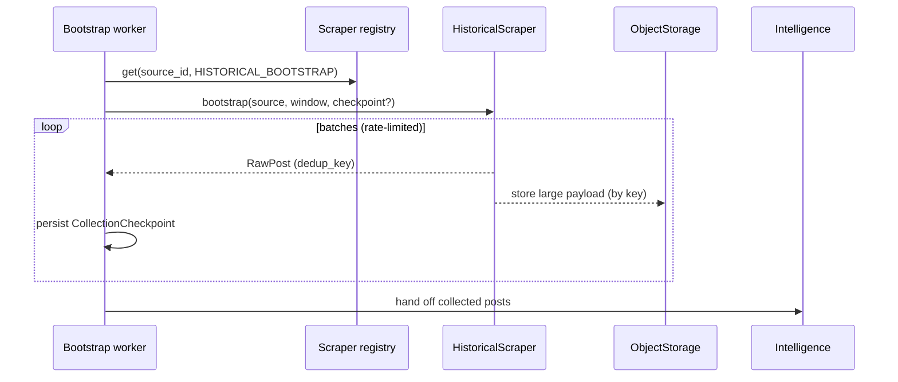
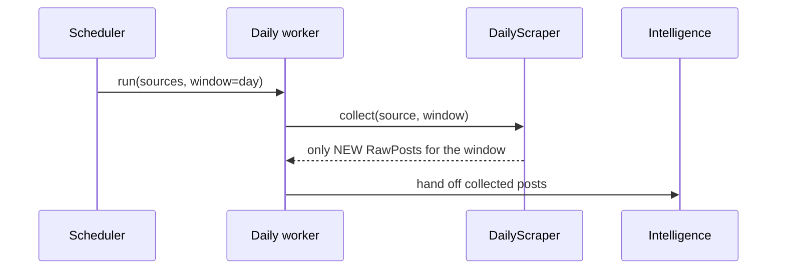

# Scraper Lifecycle

TIDE has **two fundamentally different collection modes**, kept as separate
workflows so they can be executed, scaled, and reasoned about independently.
Both share the `BaseScraper` contract but are driven by different workers.

> Phase 0 implements **no scraper and contacts no source**. The workers plan
> windows and report a plan; with an empty registry, all sources are "skipped".

## A. Historical bootstrap (one-time)

Driven by `workers/bootstrap.py` (`HistoricalBootstrapWorker`), implementing
`contracts.scrapers.HistoricalScraper`.

- Uses a **configurable seed list** (`infrastructure/seeds/seeds.example.yaml`).
- Collects history starting **~2 months before the system start date**
  (`TIDE_HISTORICAL_LOOKBACK_DAYS`, default 60).
- Required properties:
  - **Resumable** — continues from a `CollectionCheckpoint`.
  - **Idempotent** — re-running a completed window creates no duplicates.
  - **Checkpointed** — progress persists per source; a crash loses ≤ one batch.
  - **Rate-limit aware** — honours `TIDE_SCRAPER_RATE_LIMIT_PER_MIN`.
  - **Deduplicating** — keyed by `RawPost.dedup_key` (`source_id:external_id`).
  - **Source-agnostic** — via the common scraper interface + registry.
  - **Separately executable** — its own worker/entrypoint, not daily.

## B. Daily collection (scheduled, recurring)

Driven by `workers/daily.py` (`DailyCollectionWorker`), implementing
`contracts.scrapers.DailyScraper`.

- Collects **only new posts** for each day from configured sources.
- **Must NOT** re-download the historical dataset.
- Supports **configurable collection windows**, so any date/period can be
  **replayed** simply by supplying a different window (`window_for_day(day)`).

## Shared machinery

`scrapers/base/` is reserved for source-agnostic building blocks (rate limiting,
checkpoint persistence, dedup helpers) so individual source scrapers in
`scrapers/sources/` stay thin. Empty of implementation in Phase 0 by design.
